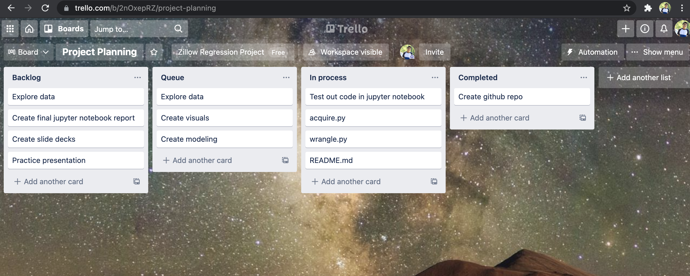

# Zillow Regression Project

Hi!

This is the README file for the Zillow Regression Project.

In here, you'll find information on this project like goals, steps, and a data dictionary.
***

## **Data Story**
**Why are we here?**

- Goal 1: *Predict the values of single unit properties based on sold data from May-June of 2017*
- Goal 2: *Identify the county & state where the properties are located in addition to the distribution of property tax rates*
***

## Data Source
- This data is being pulled from a SQL database under the name 'Zillow'
    - For this project, I am utilizing the 2017 properties and predictions tables along with the property landuse type table
- The data can also be pulled from Kaggle.com
    - https://www.kaggle.com/c/zillow-prize-1/data
- This repository also has a CSV of the data available as well
***

## Project Planning

In addition to this README, you can see my Trello board by visiting the following link: https://trello.com/b/2nOxepRZ

Here is a screenshot of my planning board

***

## Data Dictionary

- Please use this data dictionary as a reference for the variables used within in the data set.

| Feature       | Data type     | Description     |
| :------------- | :----------: | -----------: |
|  parcelid | int64   | Unique parcel identifier    |
|  landuse_id  | float64 | Identifier for landuse type |
|  landuse_desc	| object	| Describes the type of landuse |
| last_sold_date	| object	| transaction date of when property last sold | 
| total_sqft	| float64	|Total livable square footage |
| bedroom_quanity	|float64|	count of bedrooms |
| bathroom_quanity	|float64|	count of bathrooms |
| fips	|object|	Federal Information Processing Code (county code) |
| zip_code	|object|	5 digit code used by US Postal Service |
| year_built	|object	|year home was built |
| tax_assesed_value	|float64	|total value of home established by taxing authority | 
| latitude	|float64|	geographic coordinate that specifies the north–south position |
| longitude	|float64|	geographic coordinate that specifies the east-west position |
| tax_assess_yr	|float64|	The most recent year property taxes were assessed |
| property_tax|	float64	|ad valorem tax on the value of a property. |
| age_of_home	|int64	|age of home as of today's date in years |
| tax_rate	|float64|	This is property tax / tax_assessed_value |
| baths_pers_qft	|float64	|numbers of baths per sqft |
| beds_pers_qft	|float64	|number of beds per sqft |
***

## Hypothesis and Questions
- Is there a relationship between bathroom quantity and total sqft?
- Is there a relationship between bathroom quantity and tax appraised value?
- Is there a relationship between total sqft and tax appraised value?
- Is there a relationship between latitude and tax appraised value?
- Is there a relationship between longitude and tax appraised value?

**The questions above will be answered using correlation tests while the last one comparing the means of two subgroups will be achived through a T-Test.**
***

## How To Recreate This Project
To recreate this project you will need use the following files:

`wrangle.py` `acquire.py` `env.py`

Your target variable will be tax_assessed_value which is defined in the above data dictionary. Please visit my final notebook to see this variable being used.

**Step 1.** Import all necessary libraries to run functions. These can be found in each corresponding .py file

**Step 2.** Use acquire.py to help pull data from your SQL database. You will need to have your own env.py file with your login information to be able to connect and pull from your SQL database.

**Step 3.** To see the the cleaned data set before training do the following:

`df = wrangle_zillow()`

After you have gotten to know the data set, run the following to gather the train, validate, test data

`train, validate, X_train, y_train, X_validate, y_validate, X_test, y_test = train_validate_test(df, 'tax_assessed_value')`

**Step 4.** Verify that your data has been prepped using df.head()

**Step 5.** Enter the explore phase. This could mean creating different line plots, swarm plots, and bar charts or running statistical tests. The associated libraries to make the charts happen are from matplotlib, seaborn, scipy, plotly and sklearn

**Step 6.** Evaluate and model the data using different regression algorithms.

- Linear Regression
- Lasso Lars
- Tweedie Regressor
- Polynomial Regressor (using a 2nd degree)
**Step 7.** After you have found a model that works, test that model against out of sample data using the function in my notebook.

For a more detailed look, please visit the Jupyter notebook named Final_Report in this repo.